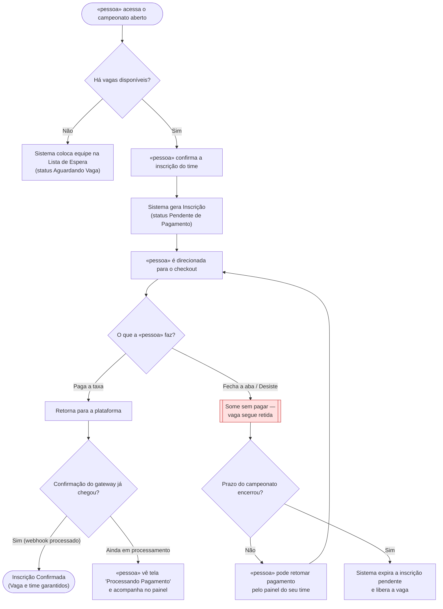

# 🗺️ Jornadas de Usuário

**Projeto:** Sistema de Inscrição para Campeonatos de E-sports  
**Versão:** 1.0.0  
**Última atualização:** 2026-09-25  

> 🤖 **Este documento é a fonte da verdade sobre O QUE A PESSOA VIVE na tela** —
> o caminho do primeiro clique até o objetivo, e principalmente os pontos onde ela
> trava, espera ou desiste.
>
> ✍️ **Não preencha na mão:** rode `/utf-flows`. A entrevista escolhe a história que
> merece o desenho, obriga o ponto de desistência a aparecer e cobra a decisão sobre
> ele.
>
> 🚫 **Não duplique:** regra de negócio mora no `prd.md`; estado, entidade e contrato
> moram no `architecture.md`. Aqui mora o caminho.

---

## Jornada 1 — Inscrição e Pagamento da Taxa

**Story:** US03, US04, US05  
**Critérios que ela marca:** Sai do site e volta · Depende do tempo · Depende de outra pessoa/agente agir · Pode ser abandonada no meio (4/4)

**O que decidimos sobre o nó vermelho:**

Se o capitão fechar a aba ou desistir no momento do checkout, a inscrição permanece com status "Pendente de Pagamento" e a vaga continua reservada para a sua equipe até o encerramento do prazo final de inscrições do campeonato — não há timeout curto de expiração. O capitão pode retornar a qualquer momento antes do término das inscrições através do painel da equipe para concluir o pagamento. Caso o prazo do torneio expire sem que o pagamento seja liquidado, o sistema expira a inscrição pendente automaticamente e libera a vaga (conforme US04 e RN02).

---

## Dúvidas em aberto

| # | Dúvida | Onde ela precisa ser resolvida |
| - | ------ | ------------------------------ |
| 1 | Quando uma vaga é liberada após o término do prazo regular (ou próximo do fim), quanto tempo o primeiro time da Lista de Espera tem para pagar? | `/utf-architecture` (definição de job de expiração e janelas de tolerância) |
